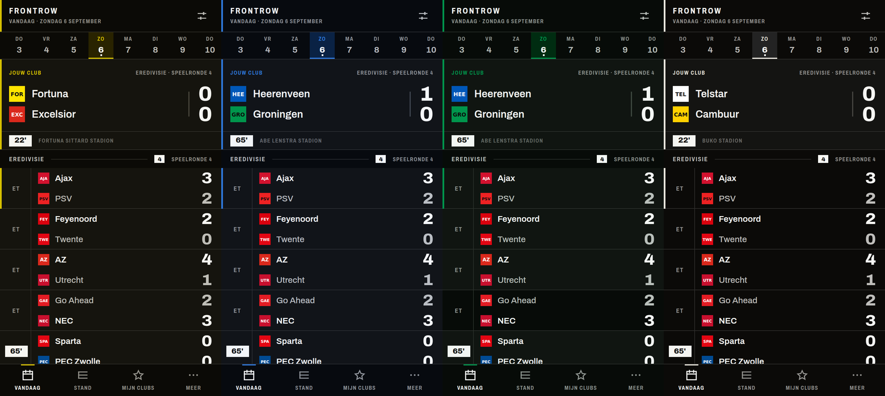

# ⚽ Frontrow

Live voetbalscores voor het Nederlandse voetbal, **zonder één advertentie**, op je
eigen Raspberry Pi. Draait als Home Assistant-app naast je dashboard, en op de
telefoons in huis als gewone webapp.

> Frontrow neemt de kleuren van jouw club over. Kies Ajax en de app wordt rood;
> kies Heerenveen en hij wordt koud blauw; kies Fortuna Sittard en hij wordt
> geel. Niet als thema-optie — de hele interface wordt eruit afgeleid.



---

## Waarom

LiveScore en FlashScore zijn allebei gokbedrijven met een scorebord ervoor. Hun
eigen advertentiepagina's verkopen interstitials, video-preroll, gesponsorde
opstellingen en gokquotes onder élke wedstrijd in de lijst — en de reclamevrije
versie is bij beide een betaald abonnement.

Frontrow is de reclamevrije versie, gratis, op je eigen hardware:

| | LiveScore / FlashScore | Frontrow |
|---|---|---|
| Advertenties | interstitials, sticky banners, video-preroll | geen, nooit |
| Gokquotes | onder elke wedstrijd | geen |
| Cookiemuur | IAB TCF, honderden vendors | niet nodig — er is geen derde partij |
| Verzoeken naar derden | tientallen per scherm | **nul** (ook clublogo's lopen via je eigen Pi) |
| Reclamevrij | €3,99/maand | inbegrepen |
| Waar je data staat | bij hen | op je eigen SD-kaartje |

## Wat het doet

- **Vandaag** — één overzicht van de dag. Wat nu live is staat bovenaan in de
  **NU**-balk, gesorteerd op spanning: een 1–1 in de 88e minuut staat boven een
  4–0 in de 20e. Daarboven jouw club, altijd.
- **Live** — scores komen binnen over een open verbinding, niet door te
  verversen. Een doelpunt staat op je scherm in hetzelfde beeldje waarin de
  server het hoort.
- **Wedstrijd** — een tijdlijn die je kunt *lezen*: elk voorval staat op zijn
  echte minuut, dus je ziet de vorm van de wedstrijd voordat je een woord leest.
  Plus opstellingen op een veld, statistieken en onderlinge duels.
- **Stand** — met Europese plaatsen en degradatiezone in de kantlijn, een
  live-stand die meerekent wat er nú gespeeld wordt, en jouw club die nooit
  van het scherm verdwijnt.
- **Mijn clubs** — één tijdlijn over alle clubs die je volgt.
- **Meldingen** — per club, per soort. Doelpunten, aftrap, rust, eindstand,
  rode kaarten. Standaard rustig.
- **TV-modus** — een groot scorebord voor een scherm aan de muur, dat Home
  Assistant vraagt zijn eigen menubalk te verbergen.
- **Spoilervrij** — verberg uitslagen tot je ze zelf aantikt, voor als de
  samenvatting nog moet.
- **Home Assistant** — sensoren voor live wedstrijden, jouw club en de
  eerstvolgende wedstrijd, plus een `frontrow_goal`-event met de clubkleuren
  erin. Drie regels YAML en je woonkamer kleurt rood bij een Ajax-goal.

Competities: **Eredivisie, Keuken Kampioen Divisie, KNVB Beker, Johan Cruijff
Schaal en Oranje**. Champions League, Europa League en Conference League zitten
er al in en staan één regel van aanzetten af.

## Installeren op Home Assistant

1. **Instellingen → Add-ons → Add-on Store → ⋮ → Repositories**
2. Voeg `https://github.com/williamvz/Frontrow` toe
3. Installeer **Frontrow** (de eerste build duurt op een Pi 5 een paar minuten)
4. Bij **Configuratie**: zet `favourite_team` op je club (`ajax`, `feyenoord`,
   `psv`, `go_ahead_eagles`, …). Verder hoef je niets in te vullen.
5. **Starten** → **Frontrow** verschijnt in de zijbalk.

Voor de telefoons in huis: `http://<ip-van-je-pi>:8199`. Zet die op je
beginscherm — niet de Home Assistant-link, want die sessie verloopt.

### Meldingen op je telefoon

Webpush werkt alleen over een beveiligde verbinding. In de praktijk betekent dat
Nabu Casa of een eigen certificaat (bijvoorbeeld de DuckDNS-app). Over
`http://<ip>:8199` verstopt de app de knop in plaats van te doen alsof het werkt.
Op een iPhone moet je Frontrow eerst op je beginscherm zetten; vul dan ook
`vapid_contact` in met een echt mailadres, want Apple weigert anders de melding.

### Uitproberen zonder wedstrijden

Zet `demo_mode: true` en herstart. Frontrow speelt dan een verzonnen
Eredivisie-speelronde af in twaalf minuten — scores lopen op, doelpuntenmakers
verschijnen, de stand beweegt en je meldingen gaan écht af, zodat je je telefoon
kunt testen in juli. Dat gebeurt op een aparte database; je echte historie blijft
ongemoeid.

## Zonder Home Assistant

```bash
cp .env.example .env      # zet FAVOURITE_TEAM
docker compose up -d --build
# → http://localhost:8199
```

## Home Assistant-automatisering

Frontrow vuurt `frontrow_goal` af met de clubkleuren erin, dus een automatisering
hoeft zelf niets op te zoeken:

```yaml
automation:
  - alias: "Woonkamer kleurt bij een doelpunt"
    trigger:
      platform: event
      event_type: frontrow_goal
    condition: "{{ trigger.event.data.is_favourite }}"
    action:
      - service: light.turn_on
        target: { entity_id: light.woonkamer }
        data:
          rgb_color: "{{ trigger.event.data.rgb }}"
          flash: short
      - service: tts.google_translate_say
        data:
          entity_id: media_player.keuken
          message: "{{ trigger.event.data.message }}"
```

Beschikbare entiteiten: `sensor.frontrow_live_matches`,
`sensor.frontrow_favourite`, `sensor.frontrow_next_match`. Events:
`frontrow_goal` en `frontrow_match_status`.

## Hoe het werkt

```
node-cron + adaptieve klok (Europe/Amsterdam)
├─ elke 20s   — alleen als een club die je volgt speelt
├─ elke 60s   — als er iets anders live is
├─ elke 5min  — als er vandaag nog wordt gespeeld
├─ elke 30min — als er niets is
├─ 05:30      — programma ophalen (afgelastingen, verzette wedstrijden)
└─ bij start  — alles inhalen wat gemist is toen de Pi uit stond
```

Een live-ronde vraagt alleen naar competities waar op dat moment iets gebeurt.

- **Bron:** de publieke API van ESPN — geen sleutel, geen registratie.
- **Reserve:** TheSportsDB, dat het programma en de einduitslagen blijft leveren
  als ESPN eruit ligt.
- **Offline:** een ingebouwde replay-provider die een hele speelronde naspeelt.
  Die drijft de demomodus én de volledige testsuite aan.

Clubnamen worden genormaliseerd (`PSV` / `PSV Eindhoven`, `FC Twente` /
`Twente`, `sc Heerenveen` / `Heerenveen`) en de provider-id wordt onthouden
zodra hij één keer gezien is.

## Bouwen en testen

```bash
cd frontrow/backend  && npm install && npm test     # 25 tests, geen netwerk nodig
cd ../frontend       && npm install && npm test     # contrast, alle 39 clubs
npm run theme:audit                                 # contactvel van alle thema's
npm run dev                                         # vite, proxy naar :8199
```

De testsuite speelt een volledige speelronde door de echte sync-engine en
controleert dat scores kloppen met de tijdlijn, dat een doelpunt precies één keer
wordt aangekondigd, en dat de stand optelt. Er is geen internetverbinding voor
nodig — een voetbalapp die je alleen tijdens een wedstrijd kunt testen, kun je
niet testen.

## Stack

```
repository.yaml          # Home Assistant add-on-repository
frontrow/
├─ config.yaml           # app-manifest (ingress, opties, watchdog, back-up)
├─ Dockerfile            # node:24-alpine, geen compiler nodig op de Pi
├─ translations/         # nl + en voor het configuratiescherm
├─ backend/              # Express 5 + better-sqlite3 + node-cron
│  ├─ src/providers/     # espn · sportsdb · replay
│  ├─ src/sync/          # engine, planner, stand
│  ├─ src/realtime/      # SSE-hub
│  └─ src/services/      # Home Assistant, webpush, meldingen
└─ frontend/             # React 19 + Vite 8 + Tailwind 4, PWA
   └─ src/theme/         # de clubthema-engine (OKLCH + WCAG)
```

---

Gemaakt voor de zaterdagavond. Hup Holland Hup 🇳🇱
